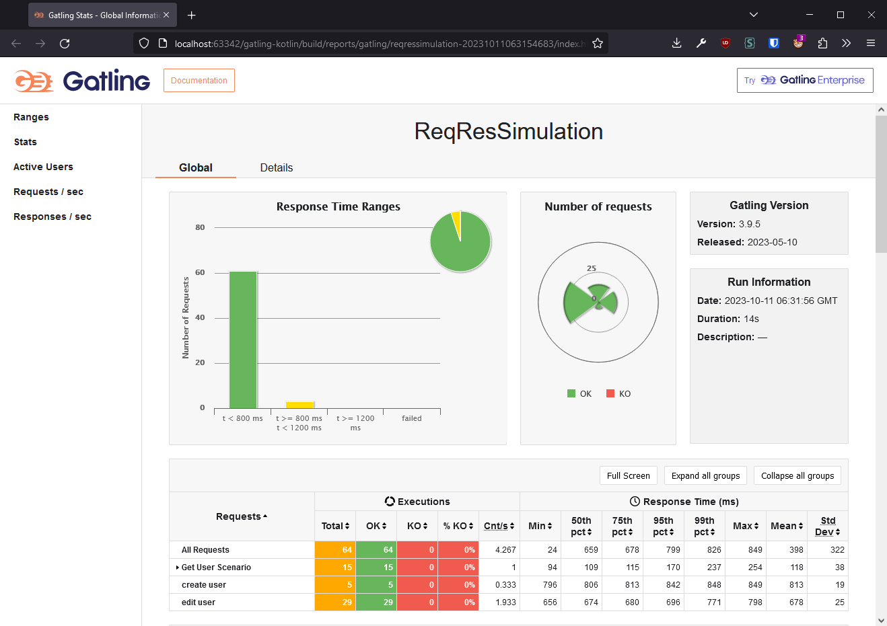

# Gatling Kotlin Project

## Description

This project serves as a tutorial for those looking to start learning about Gatling. It provides a Gatling simulation written in Kotlin, designed to perform load testing.

## Table of Contents

1. [Getting Started](#getting-started)
    - [Installation](#installation)
    - [Quick Start](#quick-start)
2. [Example Simulation Flows](#example-simulation-flows)
3. [Acknowledgement](#acknowledgment)
4. [Note on Usage](#note-on-usage)
5. [Contact](#contact)

## Getting Started

### Installation

To run this project, you will need the following tools:

- [IntelliJ IDEA](https://www.jetbrains.com/idea/download/) - An integrated development environment.
- [Gradle](https://gradle.org/install/) - A build automation tool.

### Quick Start

1. Clone the project repository:

    ```shell
    git clone https://github.com/marvelfrozen/gatling-kotlin.git
    ```

2. Open the project in IntelliJ IDEA.

3. Wait for IntelliJ IDEA to resolve and download all Gradle dependencies. This process might take a few moments.

4. Use the following command to run a Gatling simulation:

    ```shell
    gradle gatlingRun-simulation.ReqResSimulation
    ```

5. The test results will be generated in the `build/reports/gatling` folder.
   

## Example Simulation Flows

This section describes the ReqResSimulation flows included in this project. The simulation consists of several Gatling scenarios that cover different API interactions.

### Flow 1: List of Users and User Detail

This flow simulates querying a list of users and retrieving user details using the IDs obtained from the previous call to the list of users. The two calls are grouped together to represent this common use case.

- **Scenario:** GetUserScenario
- **Steps:**
   1. Execute a request to retrieve a list of users.
   2. Extract the first user ID from the response.
   3. Send a request to retrieve user detail.

### Flow 2: Create User

This flow demonstrates creating a new user using a POST request.

- **Scenario:** CreateUserScenario
- **Steps:**
   1. Execute a request to create a new user.

### Flow 3: Update User

In this flow, the project includes a separate simulation for updating an existing user's information using a PUT request.

- **Scenario:** EditUserScenario
- **Steps:**
   1. Execute a request to update the user's information.


## Acknowledgment

This project uses the ReqRes.in service for the example simulation. We appreciate their contribution to the developer community.

## Note on Usage

While using this project for load testing and performance testing, please ensure responsible usage. Do not attempt to overwhelm or perform Distributed Denial of Service (DDoS) attacks on external services, including ReqRes.in. Always respect the terms of use and usage policies of any third-party services you interact with.

## Contact

For any questions or assistance related to this project, feel free to reach out to me:

- **Name:** Gavril
- **Email:** [marvelfrozen@gmail.com](mailto:marvelfrozen@gmail.com)
- **LinkedIn:** [linkedin.com/in/gavrilafb](https://www.linkedin.com/in/gavrilafb)